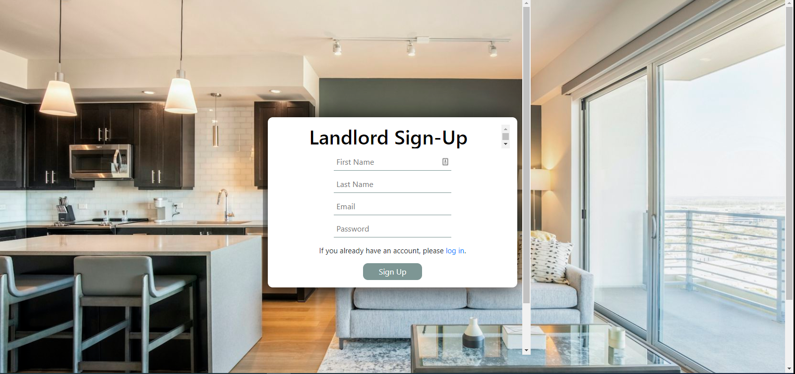
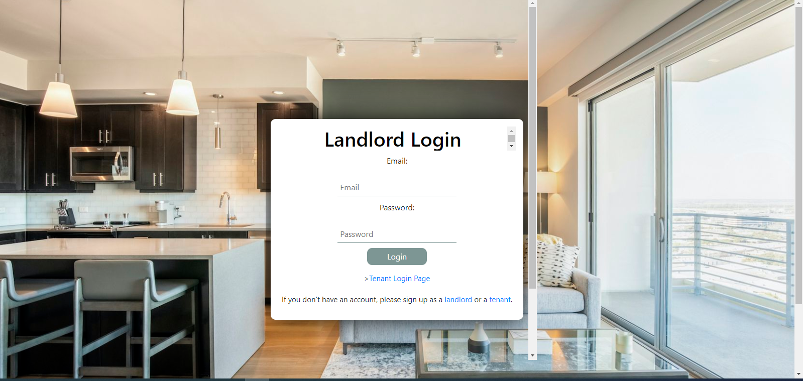
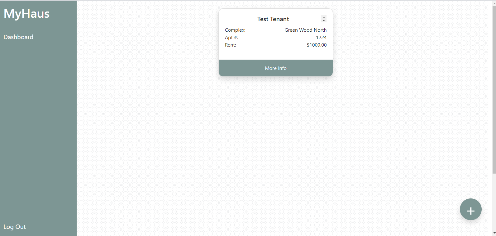
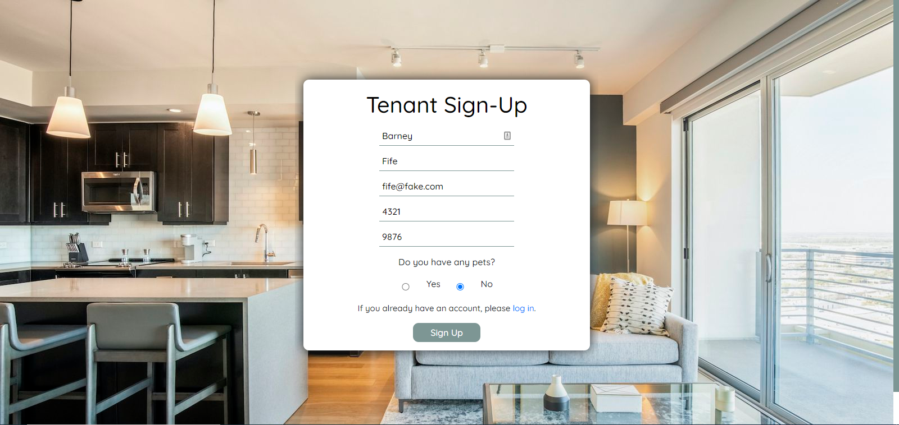
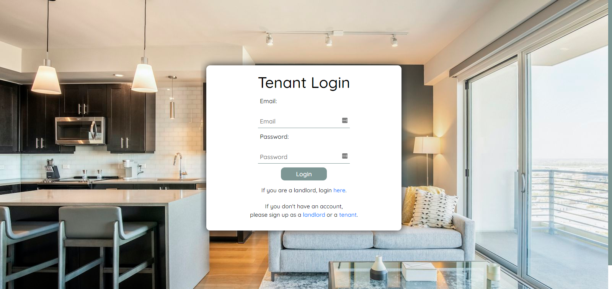
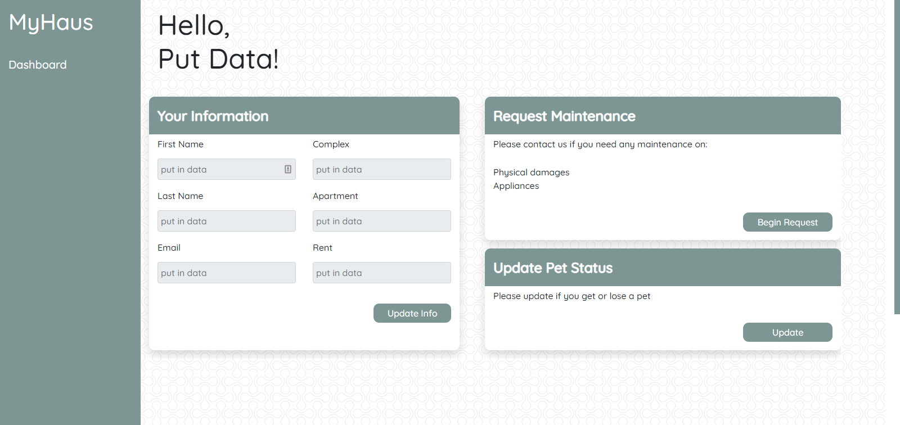

# MyHaus

## Table of Contents
* [Description](#description)
* [Installation](#installation)
* [Usage](#usage)
* [License](#license)
* [Contributors](#contributors)
* [Tests](#tests)
* [Links](#links)
* [Screenshots](#screenshots)
* [Questions](#questions)

## Description:
The app consists of two user portals: one that allows landlords to manage their properties and tenants, and a second that allows tenants to submit routine maintenance requests and pet updates for landlord review. 

## Installation:
1. Clone from Github repository.  
2. Install required npm packages:  
* Node.js  
* Express  
* Express-Session  
* Express-Handlebars  
* Handlebars  
* Sequelize  
* Bcrypt  
* Dotenv  
* MySql2  
* Connect-Session Sequelize  
* Nodemon (recommended) 
3. Run MySql and source the database. (Command: "source db/schema.sql;) 

## Usage:
Through Local Server: 
1. Start from the terminal using "npm start" command.  
2. Go to "localhost:3001/signup" in the browser to access app.  
3. Input required fields and use links to navigate through site. (See Tests) 
 

Through Deployed Application: 
1. Go to "https://myhaus.herokuapp.com/" in the browser to access app.
2. Input required fields and use links to navigate through site. (See Tests) 

## License:
This Repository is covered under the following license: [ISC]

## Contributors:
Tara Brichetto, Joseph DeFelice, Richard Flores, Stephen Pena, Chris Walston 

## Tests:
1. Go to "https://myhaus.herokuapp.com/signup" in the browser to access the app.  
2. Fill in the required fields to create a landlord account and click "sign up."  
3. From the landlord dashboard, click the plus sign to create a new property. Enter information into the required fields and submit.  
4. Copy the generated Property Id and click "log out."  
5. Go to "https://myhaus.herokuapp.com/tenant/signup" in the browser to create a tenant account.  
6. Fill in the required fields and paste the Property Id into the invitaiton code field. Click "sign up."  
7. Test the "Your Information" section by updating the tenant's first name, last name, or e-mail.  
8. Test the "Request Maintenance" section by clicking the "+" button to enter a maintenance request.  
9. Test the "Pet Status" section by clicking the "+" button to enter an updated pet status.
10. Click log out to exit the tenant dashboard and go to the main page "https://myhaus.herokuapp.com/"  
11. Log in with your previously created landlord email and password.  
12. Confirm the maintenance and pet requests you created in the tenant dashboard are displaying under "Maintenance Requests" and "Pet Updates" in the sidebar.

## Links:
Deployed Application: https://my-haus.herokuapp.com/
Deployed Application (Backup): https://myhaus.herokuapp.com/  
Github Repository (Final): https://github.com/tbrichet/myhaus  
Github Repository (All Drafts): https://github.com/Richardflores009/MyHaus  
Group Presentation Link: https://docs.google.com/presentation/d/1xQFHIo6Cto5SCeIT4NqHazeNlVLE9taPFQ-gR5MFmlM/edit?usp=sharing  

## Screenshots:

## Questions:
Contact me: 
Github: [https://github.com/penaone](https://github.com/penaone) 
Email: [penaone@gmail.com](penaone@gmail.com) 

